# toby_spring6
토비 스프링 6 study 
출처 : (https://www.inflearn.com/course/%ED%86%A0%EB%B9%84%EC%9D%98-%EC%8A%A4%ED%94%84%EB%A7%816-%EC%9D%B4%ED%95%B4%EC%99%80-%EC%9B%90%EB%A6%AC)

* ## section 2. 오브젝트와 의존관계
  * ### 오브젝트 ? 
    * 클래스의 인스턴스 = 오브젝트
    * 클래스는 오브젝트를 만들기 위한것
    * 클래스는 설계도, 즉 설계도를 통해 오브젝트를 생성
    * 자바에서는 배열(Array)도 오브젝트 
  * ### 의존관계 ?
    * 
    * Client의 기능이 제대로 동작하려면 Supplier가 필요
    * Client가 Supplier를 사용,호출,생성,인스턴스화,전송
    * 클래스 레벨(코드 레벨)의 의존관계 
    * Supplier가 변경되면 Client코드가 영향을 받음
    * 오브젝트 사이에 의존관계는 실행되는 런타임에 의존관계가 만들어지고 실행 기능에 영향을 받지만 클래스 레벨의 의존관계와는 다를 수 있음
    

* ## 관심사의 분리 (Separation of Concerns) -> 변경의 이유, 시점이 다른 n개 관심사들을 분리
  * ### 1. 하나의 메서드에 변하는 이유/시점이 다른 관심사들을 분리 -> 메서드 추출
    * 
  * ### 2. 하나의 클래스가 두가지의 관심사를 가지고 있다면 잘 변하는 부분을 분리 -> 상속을 통한 확장(템플릿 메서드 패턴 : 변하지 않는 부분을 상위클래스에 두고 변하는 부분을 상속을 통해 완성 )
    * 
    * 상속의 단점 : 상하위 클래스의 관계가 매우 밀접, 상위 클래스의 변경에 따라 하위 클래스를 모두 변경해야함
  * ### 3. 관심사에 따른 클래스의 분리 -> 포함(Composite) 관계
    * 
    * 클래스 레벨에 사용 의존관계가 만들어지기 떄문에 강한 코드 수준의 결합이 생김 -> 실제로 사용할 클래스가 변경되면 이용하는 쪽의 코드도 변경되어야 함
    * 상속한 것이 아니기 때문에 사용하는 클래스의 메서드 이름과 구조도 제각각일 수도 있음
  * ### 4. 인터페이스 도입
    *  
    * WebApiExRateProver 코드 수정시 PaymentService도 일부분 수정해야함 -> 클래스의 인스턴스를 만드는 생성자를 호출하는 코드에는 클래스 이름이 등장하기 때문
    * 런타임 시점의 관계
      * 
  * ### 5. 관계설정 책임의 분리
    * 
      * 자신이 어떤 클래스의 오브젝트를 사용할지를 결정 -> 관계설정 책임을 직접 가지고 있는것
      * 코드레벨에서의 의존관계 != 런타임 시점의 의존관계 -> 둘이 다를 수 있음
      * 런타임 시점의 사용해야 할 오브젝트를 설정하는 책임이 어디있는가? -> 이부분에 따라서 코드레벨의 의존관계도 달라짐
      * 의존관계를 설정하는 코드를 분리
        * 
          * 관계설정 책임을 자신을 호출하는 앞의 오브젝트(Client)에게 넘긴 것
          * Client는 생성자를 통해 어떤 클래스의 오브젝트를 사용할지 결정한 것을 전달해주면 됨
      * 
        * 여기서 Client도 2가지 관심사를 가지고 있음 
        * 런타임 시점의 오브젝트 사이의 의존관계를 설정하는 책임을 ObjectFactory에게 넘김 -> 사용과 생성을 대한 관심사를 분리
  

* ## 원칙과 패턴
  * ### 개방-폐쇄 원칙(Open-Closed Principle)
    * 클래스나 모듈은 확장에는 열려 있어야 하고 변경에는 닫혀 있어야 한다.
    * 클래스가 기능을 확장할 때 클래스의 코드는 변경 X -> PaymentService의 환율 정보를 가져오는 방법을 확장(전략패턴)/ PaymentService는 변경 X
  * ### 높은 응집도와 낮은 결합도(High Coherence and low coupling)
    * 응집도가 높다는 것은 하나의 모듈이 하나의 책임 또는 관심사에 집중되어 있다는 뜻, 변화가 일어날 떄 해당 모듈에서 변하는 부분이 큼
    * 책임과 관심사가 다른 모듈과는 낮은 결합도, 즉 느슨하게 연결된 형태를 유지하는 것이 바람직 -> 인터페이스 적극 활용
  * ### 전략 패턴(Strategy Pattern)
    * 필요한 알고리즘을 인터페이스를 통해 통째로 외부로 분리하여 구현한 알고리즘 클래스를 필요에 따라서 주입받아 사용
  * ### 제어의 역전(Inversion of Control)
    * PaymentService -> Client 권한(결정권)이 다른 곳으로 이전

* ## 스프링 컨테이너와 의존관계 주입(Dependency Injection)
  * 
  * 
  * 
      * BeanFactory는 ObjectFactory의 구성 정보를 참고해서 동작하게 만듬 
      * 스프링 IoC/DI 컨테이너 : Bean들을 필요할 떄 제공/관리
      * IoC : 어떤 오브젝트를 사용할 것인지에 대한 제어권(결정권)의 이전
      * DI : 의존관계를 외부에서 주입 -> 의존관계에 대한 책임이 외부 오브젝트가 담당 
      * BeanFactory + ObjectFactory : 외부에서 제 3의 오브젝트가 애플리케이션에서 동작할 Bean들을 생성하고 의존관계를 맺어줌 
  * 구성정보를 가져오는 2가지 방법 : @Configuration/@Bean 또는 @Component를 붙어진 클래스들을 스캔하는 @ComponentScan방식

* ## 싱글톤 레지스토리(Singleton Registry)
  * ### @Configuration 안에 있는 @Bean들을 모두 싱글톤 처리
  * ### 싱글톤 패턴의 단점
    * private 생성자를 가지고 있기 때문에 상속 X
    * 싱글톤은 테스트하기 어려움
    * 서버 환경에서는 싱글톤이 하나만 만들어지는 것을 보장 X
    * 싱글톤의 사용은 전역 상태를 만들 수 있기 떄문에 바람직 X
  * ### 스프링 컨테이너는 Bean들이 모두 기본적으로 싱글톤으로 등록됨 -> 스코프를 프로토타입으로 지정하면 여러 개의 빈 생성 가능

* ## DI와 디자인 패턴
  * 
    * 디자인 패턴을 구분하는 두 가지 방식 : 사용 목적(purpose), 스코프(scope)
      * 클래스 패턴 : 상속을 이용한 확장성을 가진 패턴
      * 오브젝트 패턴 : 합성(composition)을 이용한 패턴 -> DI(의존성 주입)이 사용됨
      * 
  * ### WebApiExRateProvider에 캐시 기능 추가? -> 데코레이터 패턴 (껍데기가 알맹이 행새, 상속과 포함을 동시에)
    * 
    * 
      * 데코레이터 패턴 -> 오브젝트에 부가적인 기능/책임을 동적으로 부여
    

* ## 의존성 역전 원칙(Dependency Inversion Principle, DI != DIP)
  * ### 1. 상위 수준의 모듈은 하위 수준의 모듈에 의존해서는 안 된다. 둘 모두 추상화에 의존해야 한다.
    * 

      * 모듈 -> 자바에서는 패키지로 모듈을 구분 
      * 둘 모두 추상화에 의존 -> 먼저 인터페이스를 통해서 추상화에 의존하도록 코드를 만들어야 함
    * 
      * 문제점 : 모듈 전체를 보면 아직 상위 모듈이 하위 모듈에 의존하고 있음 -> DIP 위배
      * 해결 : 인터페이스 소유권의 역전이 필요 (Separate Interface 패턴)
    *  
    * 인터페이스가 어떤 패키지에 들어가 있어야 하는가? -> 인터페이스는 이를 구현한 클래스와 같은 패키지가 아닌 이 인터페이스를 사용하는 쪽에 있는 것이 자연스러움
    * 하위 모듈 자체를 갈아끼울 수 있음! -> 하위 모듈이 어떤 일을 하든 상위 모듈은 영향을 받지 않음, 상위 모듈의 변경은 반대로 영향을 줌
  * ### 2. 추상화는 구체적인 사항에 의존해서는 안 된다. 구체적인 사항은 추상화에 의존해야 한다.
  
-----

* ## section 3. 테스트
  * ### 수동 테스트의 한계
    * 프린트된 메시지를 수동으로 확인하는 방법은 불편하다.
    * 사용자 웹 UI까지 개발한 뒤에 확인하는 방법은 테스트가 실패했을 때 확인할 코드가 많다
    * 테스트할 대상이 많아질 수록 검증하는데 시간이 많이 걸리고 부정확함
  * ### (작은 크기의) 자동 테스트
    * ### 개발자가 만드는 테스트
      * 검증 기능 추가, Junit 프레임워크 사용, 개발 과정의 일부임

* ## PaymentService 테스트의 문제점
  * ### 1. 우리가 제어할 수 없는 시스템에 문제가 생기면? -> ExRateProviderStub (테스트용 오브젝트 생성)
  * ### 2. ExRateProvider가 제공하는 환율 값으로 계산한 것인가? -> assert를 이용해서 예상하는 값과 비교 
  * ### 3. 환율 유효 시간 계산은 정확한 것인가? -> 학습 테스트

* ## 테스트 구성요소
  * 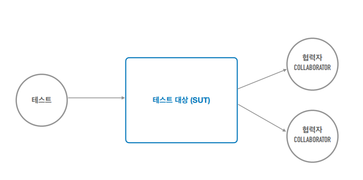
  * 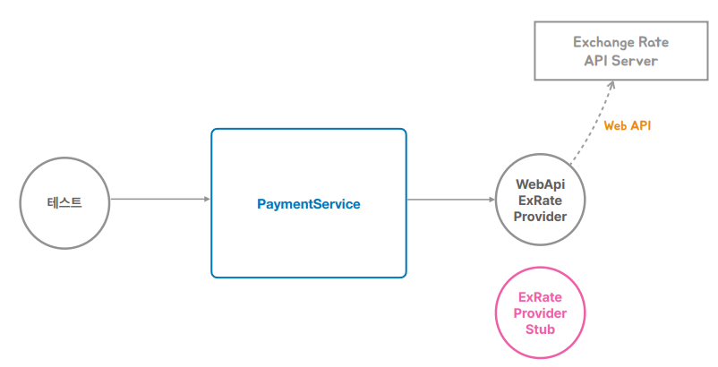
  * 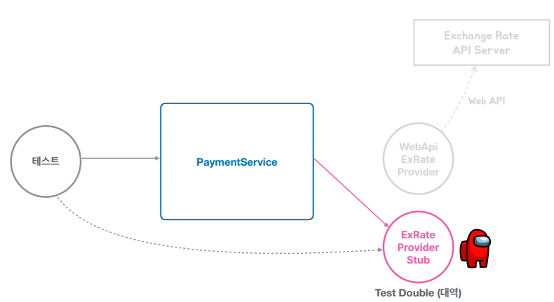
    * 테스트 대상 : PaymentService
    * 협력자 : WebApiExRateProvider
    * 테스트용 오브젝트(Test Double) : ExRateProviderStub -> 테스트를 수행하는 동안만 사용하는 오브젝트
    * 외부 API 사용시 테스트 대역을 만들어 테스트할 수 있음 (인터넷 없이도 동작이 가능)
    * isEqualByComparingTo() -> BigDecimal이 권장하는 메서드
  
* ## 테스트와 DI
  * ### 수동 DI를 이용하는 테스트
    * 테스트용 협력자((Collborator)/의존 오브젝트를 테스트 대상에 직접 주입하고 테스트
  * ### 스프링 DI를 이용하는 테스트
    * 테스트용 협력자(Collborator)/의존 오브젝트를 스프링의 구성 정보를 이용해서 지정하고 컨테이너로부터 테스트 대상을 가져와서 테스트
    *  @ContextConfiguration + @ExtendWith : 빈 구성정보 컨테이너를 불러옴, 스프링 테스팅 기능을 사용하도록 지정
    *  @Autowired : 스프링 컨테이너를 뒤져서 의존 오브젝트 자동주입

* ## 학습 테스트
  * ### 직접 만들지 않은 코드, 라이브러리, 레거시 시스템에 대한 테스트
  * ### 테스트 대상의 사용방법을 익히고 동작방식을 확인하는데 유용, 외부 기술, 서비스가 버전이 올라갔을 때 이전과 동일하게 동작하는지 확인가능
  * 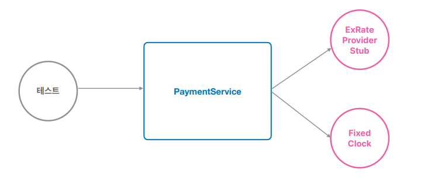
    * Fixed Clock : 시간을 정해둔 것, 우리가 만든 것이 아닌 자바 라이브러리안에 있는 것
    * PaymentService가 이용하는 의존 오브젝트로 동작할려면 빈으로 등록되어야함 -> @Configuration에 빈으로 등록되어야 함
    
* ## 도메인 오브젝트 테스트 
  * ### 도메인 모델 아키텍처 패턴 
    * 도메인 로직, 비즈니스 로직을 어디에 둘 지를 결정하는 패턴
    * 1 . 트랜잭션 스크립트 - 서비스 메서드 (PaymentService.prepare)
      * 비즈니스 로직을 서비스 계층에 넣어두는 것
    * 2 . 도메인 모델 - 도메인 모델 오브젝트 (Payment)
      * 비즈니스 로직이 엔티티 안에 구성
      * 도메인 모델 : 값만 가지고 있는 것이 아닌 기능을 수행하는 코드가 들어가 있는 것 -> Test 용이
      * Payment는 속성과 Setter&Getter만 가지고 있음 -> 도메인 오브젝트로 만들려면 비즈니스 로직을 추가하면 됨 
      * PaymentService의 비즈니스 로직을 -> Payment 로 이동 
      * 생성자 < Factory Method why? -> 의미있는 이름을 지정해줄 수 있음
      * ### 장점 ?
        * 서비스의 많은 로직이 엔티티로 이동하고, 서비스는 엔티티를 호출하는 정도의 얇은 비즈니스 로직을 가지게 됨
        * Payment 엔티티와 관련된 로직을 가지고 있기 때문에 응집도가 올라가고 중복을 방지하고, 재사용성이 올라감
        * 즉, <strong> Payment가 가지고 있는 정보(iv)를 이용해서 해낼 수 있는 작업이 있다면 Payment에게 요구하면 된다는 것! </strong>

* ## 도메인 주도 설계 (Domain Driven Development)
  * ### 도메인이 비즈니스 로직의 주도권을 가지고 개발하는 것
  * ### 장점 : 서비스의 많은 로직이 엔티티로 이동하고, 서비스는 엔티티를 호출하는 정도의 얇은 비즈니스 로직을 가지게 됨

* ## 8/21 공부하다 생긴 궁금한 것들 
  * ### DIP를 Spring MVC패턴의 3계층에 적용한다면 ? -> 컨트롤러가 있는 웹 계층과 서비스 계층에는 DIP를 적용하지 않음
    * DIP에서 의존성 역전을 하는 이유는 애플리케이션의 중심이 되는 도메인/비즈니스 로직을 가진 가장 상위 모듈이 기술적인 메카니즘을 다루는 변경 가능성이 높은 하위모듈에 의존하지 않게 만드는 것이 목적
    * 보통 서비스 계층과 이 안에서 다루는 도메인/엔티티 오브젝트가 가장 중심이 되는 상위 모듈이라고 보면 됨
    * 데이터를 다루거나, API 등 외부 서비스를 이용하는 부분에 DIP를 적용하면 인터페이스 소유권까지 역전하는게 맞음
    * 웹 컨트롤러와 같이 사용자 또는 클라이언트와 연결이 되고 주로 UI/Web 등을 담당하는 계층은 의존관계가 그대로 일반적인 아키텍처 그림에서 아래로 내려가는 것이 맞음
    * 일반적인 요청 흐름 : 웹 -> 서비스 -> 데이터
    *  가장 상위(정책, 로직) 모듈을 가리키게 됨 : 웹 -> 서비스 <- 데이터

  * ### @Configuration 적용 전후 차이 ?
    * 적용 전: @Configuration이 없으면, TestObjectFactory는 단순한 자바 클래스처럼 동작하여 @Bean 메서드가 호출될 때마다 새로운 객체를 생성
    * 적용 후: @Configuration이 있으면, 스프링 컨테이너는 TestObjectFactory 클래스를 프록시로 감싸서 싱글톤 패턴을 보장하며, 이를 통해 동일한 빈 인스턴스를 반환
    * 즉, <strong> @Configuration이 있으면, 모든 @Bean 메서드는 스프링 컨테이너에서 관리 </strong>

  * ### DTO vs Entity(Domain) ?
    * 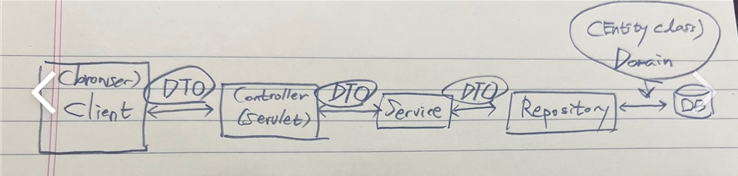
    * 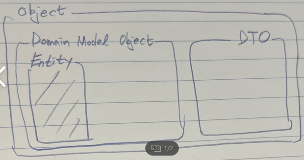
      * Client <- dto -> controller(web) - service - repository(dao) <- domain(entity) -> DB
      * DTO :  각 계층 간을 이동할 때 데이터를 '전달'해주는 클래스
      * Domain : 소프트웨어로 해결하고자 하는 문제 영역
      * Domain Model Object :  도메인 모델 객체는 해당 도메인의 비즈니스 로직이나 요구사항을 포함
      * Entity : 엔티티(entity)는 DB의 테이블이나 도큐먼트를 표현하는 객체
  
---

* ## section 5. 템플릿
  * ### 개방 폐쇄 원칙 (OCP)
    * 클래스나 모듈은 확장에는 열려 있어야 하고 변경에는 닫혀 있어야 한다
      * 어떤 코드는 변경을 통해서 그 기능이 다양해지고, 확장하려는 성질이 있음
      * 또 어떤 부분은 고정되어 있고, 변하지 않으려는 성질을 가지고 있음
      * => 이 둘이 섞여서 나오는데 변경의 시점/이유를 통해 분리해야함
    * 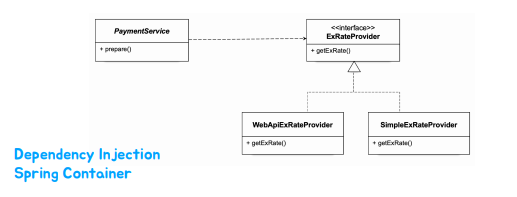
      * 해당 구조가 OCP 원칙을 잘 지키고 있음
      * DI를 통한 의존 오브젝트를 주입 받아 작동을 함

  * ### 템플릿 
    * 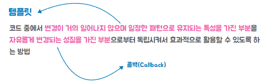
      * => OCP를 잘 지키기 위해서 (템플릿 콜백 패턴)

  * ### WebApiExRateProvider Refactoring
    * Refactoring(리펙터링) : 기능을 추가, 수정 X, 구조만 개선 -> 변경에 유리한 코드로
    * 리펙터링의 핵심은 기능이 변경되지 않고, 구조를 개선하여 자동화된 테스트를 통해 검증하는 것
    * 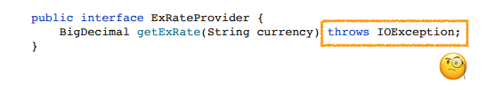
      * IOException 어쩔거임?
        * 이를 구현한 SimpleExRateProvider는 getExRate메서드에서 예외를 안던짐 -> 즉 IOException을 무조건 던지는건 아니라고 봄
      * Catch 하는 이유?
        * 가장 큰 이유 -> 복구하기 위해
        * 만약, 복구 할만한 설계가 없다면 그냥 무시하도록 하면됨
      * 결론 : checked Exception이 아닌 RuntimeException으로 변경해서 던지면 예외를 던지지 않아도 됨
        * RuntimeException은 throws를 선언하지 않아도 제일 앞단(tomcat)까지 던져짐 
      * 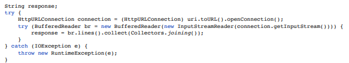
        * try-with-resource를 이용한 리소스 반환(AutoCloseable)
        * BufferReader는 AutoCloseable 인터페이스의 구현체이기 때문에 try()문에 넣으면 자동으로 resource를 반환함
        

  * ### 변하는 코드 분리하기 (메서드 추출)
    * WebApiExRateProvider의 구성
      * 1 . URI를 준비하고 예외처리를 위한 작업을 하는 코드 -> API로부터 환율 정보를 가져오는 코드의 기본 틀 (변경되지 않으려고 하는 성질)
      * 2 . API를 실행하고 서버로부터 받은 응답을 가져오는 코드 -> API를 호출하는 기술과 방법이 변경될 수 있음 (변경하려는 성질)
      * 3 . JSON 문자열을 파싱하고 필요한 환율정보를 추출하는 코드 -> API응답의 JSON 구조에 따라 정보를 추출하는 방식이 변경 (변경하려는 성질)
    * 확장이 필요할 수 있는 부분을 메서드로 추출
      * 2번과 3번 -> 변경되고 확장하려는 성질
        * 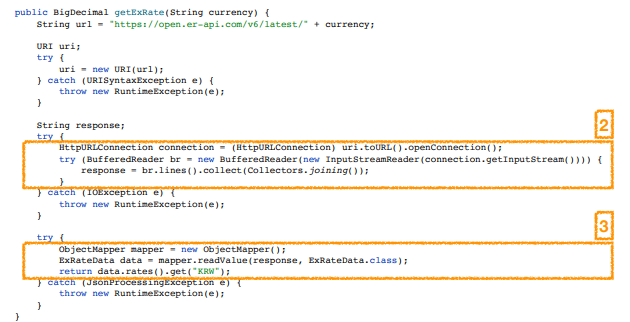
      * 1번과 try-catch문들 -> 잘 바뀌지 않으려는 성질
        * 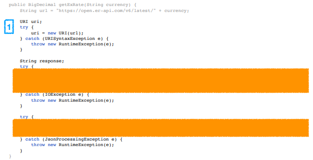
      

  * ### 변하지 않는 코드 분리하기 (메서드 추출 - 템플릿의 탄생)
    * 템플릿(Template) : 어떤 목적을 위해 미리 만들어둔 모양이 있는 틀
      * 고정된 틀 안에 바꿀 수 있는 부분을 넣어서 사용하도록 만들어진 오브젝트 -> 고정된 작업 흐름 안에 변경할 수 있는 코드를 콜백 형태로 전달해서 사용할 수 있도록 만들어진 오브젝트
      * 고정된 틀을 만들어 놓는 이유 ? -> 재사용 하기 위해서
    * 템플릿 메서드 패턴의 템플릿 != 템플릿 
      * 템플릿 메서드 패턴 : 고정된 틀의 로직을 가진 템플릿 메소드를 슈퍼클래스에 두고, 바뀌는 부분을 서브클래스의 메소드에 두는 구조
    * 메서드 추출 -> 보기 좋음 but 확장성이 떨어짐 -> 인터페이스 도입과 클래스 분리 

  * ### ApiExecutor 분리 (인터페이스 도입과 클래스 분리)
    * 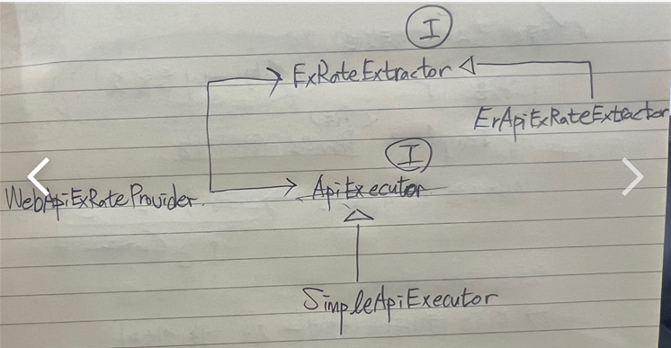
      * 템플릿을 사용하는 장점을 누릴 수 없음 -> 콜백을 통해 메서드 주입 

  * ### ApiExecutor 콜백과 메서드 주입 (Callback + Method Injection)
    * 콜백 :  실행되는 것을 목적으로 다른 오브젝트(템플릿)의 메소드에 전달되는 오브젝트 -> 하나의 메서드를 가진 인터페이스 타입의 오브젝트 또는 람다 오브젝트
      * 파라미터로 전달되지만 값을 참조하기 위한 것이 아니라 특정 로직을 담은 메소드를 실행 시키는 것이 목적
    * 템플릿/콜백은 전략 패턴의 특별한 케이스
      * 템플릿 -> 전략 패턴의 컨텍스트 (변하지 않는 틀)
      * 콜백 -> 전략 패턴의 전략 
      * 특별한 케이스 ? -> 메서드 하나만 가진 전략 인터페이스를 사용하는 전략패턴임 
      * 변하는 속성들을 가진 코드는 콜백 형태로 만들어서 템플릿의 메서드 파라미터로 전달
    * 메서드 주입 (메서드 호출 주입, DI의 한 종류)
      * 컨테이너의 구성 정보에 포함되지 않고(Bean으로 등록X) 메서드 실행 시점에 의존 오브젝트를 파라미터로 주입하는 방식
      * 콜백은 템플릿에 메서드 주입 방식으로 전달됨 
        * 템플릿은 메서드의 파라미터에 인터페이스 타입의 매개변수를 선언해둠
        * why? -> 템플릿은 무엇을 주입하는지 몰라야 하기 때문 (변하지 않는 틀)
    * 콜백 간단히 만드는 법
      * 클래스의 정의 + 클래스 오브젝트를 생성하는 것 => 익명 클래스 (lamda)
    * 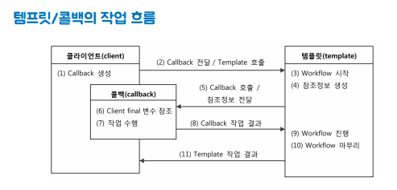
      * 템플릿의 메서드를 호출해주는 부분을 클라이언트로 이전 -> IoC(제어의 역전)
      * 클라이언트가 콜백을 생성해서 파라미터로 넘겨 템플릿의 메서드를 호출 
  
  * ### ExRateExtractor 콜백 (Callback + Method Injection)
    * 람다식을 만들어서 콜백을 던지면 클래스 만들지 않아도 됨 why? 딱 한번만 사용디ㅗ고 말 것이기 때문에
    * 람다식 -> 파라미터&리턴값만 알면 됨

  * ### ApiTemplate 분리 (환율정보 API의 기본 틀)
    * 환율정보 API로부터 환율을 가져오는 기능을 제공하는 오브젝트
    * API 호출과 정보 추출의 기본 틀 제공
    * 두 가지 콜백을 이용
    * 유사한 여러 오브젝트에서 재사용 가능 
    
  * ### 디폴트 콜백과 템플릿 빈 (재사용 가능한 Template Bean)
    * 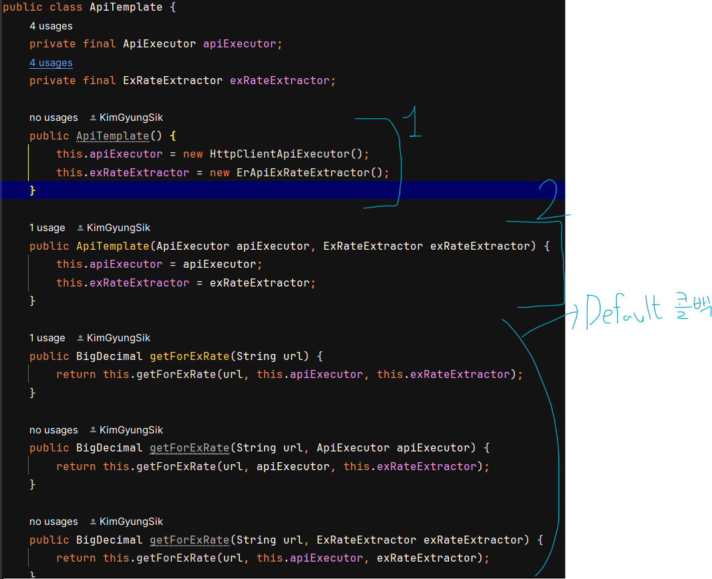
      * 디폴트 콜백 : 주입 받을 콜백을 필드로 선언해 템플릿 생성 시 주입 받아 템플릿 메서드로 전달하는 것
      * 템플릿을 공유 가능한 오브젝트로 사용할 것인지 ? 
        * 오브젝트를 만드는 결정권을 가진 Spring Container(스프링 구성정보 + 빈)안에 싱글톤 빈으로 등록 
      * 싱글톤 빈으로 만들기 위한 조건
        * 한번 만들어 놓고 여러 쓰레드에서 접근할 것이기 때문에 주의해야함
        * -> 그 오브젝트가 상태값(iv)를 가지고 있는 경우 
        * 즉, 업데이트 되거나 등록되는 정보(iv)를 가지고 있다면 싱글톤으로 생성 못함
      * 템플릿 클래스 생성 시 
        * 그림 1 -> 디폴트 콜백을 설정할 수 있는 기본 생성자 
        * 그림 2 -> Spring 구성정보를 통해서 디폴트 콜백 코드를 건드리지 않고, 생성자를 통해 변경할 수 있도록 하는 코드

  * ### 스프링이 제공하는 템플릿
    * RestTemplate : HTTP API 요청을 처리하는 템플릿
      * 템플릿 -> 변하지 않는 흐름(flow)
      * 전략(콜백) 2가지 -> 변경 가능할 수 있게 만들어짐
        * 1 . HTTP Client 라이브러리 확장 : ClientHttpRequestFactory
          * RestTemplate이 API 호출에 사용되어지는 기술 변경 시 -> ClientHttpRequestFactory라는 인터페이스로 만들어진 전략(콜백)을 변경 
          * 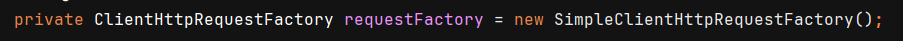
            * SimpleClientHttpRequest -> 기본 전략(콜백)
          * 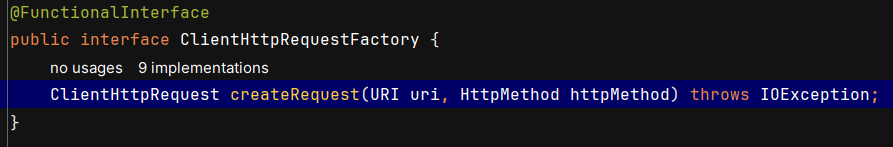
            * 콜백이기 때문에 메서드가 1개
          * 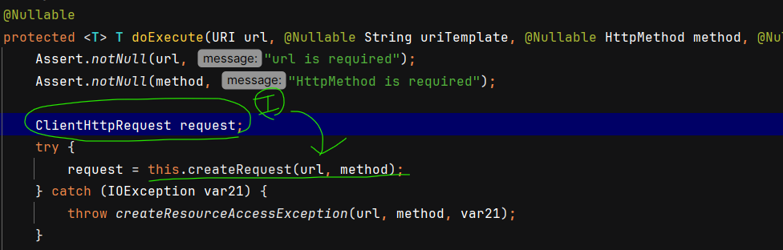
            * request 변수에 ClientHttpRequestFactory의 구현체가 담김
        * 2 . Message Body를 변환하는 전략 : HttpMessageConverter

    * ClientHttpRequestFactory : HTTP Client 기술을 사용해서 ClientHttpRequest를 생성하는 전략(콜백)
      * SimpleClientHttpRequest (HttpURLConnection)
      * JdkClientHttpRequest (HttpClient) 

    * doExecute() : RestTemplate에서 쓰이는 핵심 템플릿 메서드(핵심 workflow), 2개의 인터페이스 타입의 콜백을 받음
      * 1 . RequestCallback -> void doWithRequest(ClientHttpRequest request) throws IOException;
      * 2 . ResponseExtractor -> T extractData(ClientHttpResponse rsponse) throws IOException;
      * execute(), getForObject(), postForEntity(), .. 등등의 편리한 메서드 제공 -> 디폴트 콜백을 위한 메서드
    
    * 스프링의 Template
      * JdbcTemplate, JmsTemplate, TransactionTemplate, HibernateTemplate, SqlSessionTemplate....

----

* ## section 6. 예외
  * ### 예외 ? : 정상적인 프로그램 흐름을 방해하는 사건
    * 예외적인 상황에서만 사용
    * 많은 경우 예외는 프로그램 오류, 버그 때문에 발생

  * ### 예외가 발생하면 ?
    * 예외 상황을 복구해서 정상적인 흐름으로 전환할 수 있는가 ?
      * 1 . 재시도
      * 2 . 대안 -> ex) 환율정보를 가져오는 서비스를 하나 더 만든다던가.. 캐시정보를 통해..
      
    * 버그인가 ? -> ex) NullPointException 복구 못함 why? 버그이기 때문에
      * 1 . 예외가 발생한 코드의 버그인가 ? -> 복구하기 쉬움, null체그가 안되어 있다면 null체크하게끔
      * 2 . 클라이언트의 버그인가 ? -> 적절한 통보 날리기 (친절한 메세지)
    
    * 제어할 수 없는 예외상황인가 ?
      * 안내, 개발자&관리자에게 통보

  * ### 예외를 잘못 다루는 코드
    * 예외가 예외답게 처리 될려면 ?
      * 1 . 복구하던가
      * 2 . 예외를 다시 밖으로 던지던가
    * 예외를 무시하는 코드, print로 로그만 찍는 코드 (예외를 다시 던져야함)
      * 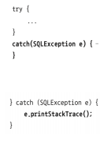
    * 무의미하고 무책임한 throws
      * 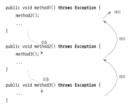
    
  * ### 예외의 종류
    * Error -> OutOfMemoryError, ThreadDeath
      * 시스템에 비정상적인 상황이 발생했을 때 사용되고 주로 JVM에서 발생시킴
      * 일반적으로 애플리케이션에서 복구를 기대할 수 없는 종류의 예외의 슈퍼 클래스
    * 체크 예외(Exception)
      * 애플리케이션이 복구를 기대할 수도 있는 모든 예외의 슈퍼 클래스
      * catch나 throws를 강요
      * 복구할 수 없다면 RuntimeException이나 적절한 추상화 레벨의 예외로 전환해서 던질 것 -> 복구할 수 있는 문제라면 복구해야함
    * 언체크 예외(RuntimeException)
      * 명시적인 예외처리가 강제되지 않음
      * catch나 throws를 쓰지 않아도 문제 없이 컴파일됨
      
  * ### 예외의 추상화와 전환
    * 사용 기술에따라 같은 문제에 대해 다른 종류의 예외 발생
    * 적절한 예외 추상화와 예외 변역이 필요
    * 스프링에서의 주요 예외처리 
      * 1 . RuntimeException의 사용
      * 2 . 예외의 추상화와 전환
  
  * ### JPA를 이용한 Order 저장
    * 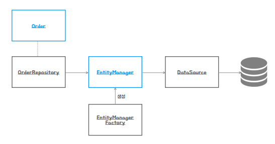
      * 파란색 박스 -> 매번 새로운 객체 생성 (빈 등록X)
      * 검정색 박스 -> 객체 생성 1번 (싱글톤으로 스프링 컨테이너에 빈 등록)
      * EntityManager -> 오브젝트를 DB가 이해할 수 있는 언어로 변환 또는 DB에서 온 정보를 다시 오브젝트로 변환할 떄 필요
      * DataSource, EntityManagerFactory -> JPA가 잘 동작하기 위해 필요한 오브젝트

  * ### Order 리포지토리와 예외
    * ConstraintViolationException 발생 -> 복구하는 작업을 해야하는데, 어떻게 처리할거임 ?
      * 다른 종류의 JPA를 지원하는 라이브러리를 사용한다고 했을 때, 예외클래스의 타입이 달라질 수 있음
      * JDBC, MyBatis 같은 데이터를 다루는 기술 사용 시 <strong> 동일한 상황에서 다른 예외가 생길 수 있다는 것</strong>이 문제임
    * 그래서 무슨 예외를 잡아야 함 ?
      * 똑같은 종류의 문제를 처리하는 코드가 항상 일정한 방식으로 예외를 다룰 수 있도록 해줘야함
      * 여기서 필요한 것이 예외 추상화와 변환임

  * ### DataAccessException과 예외 추상화
    * 고객한테 어떤 알림을 주기 위해서 필요로 하는 다른 예외, 이커머스만의 예외로 변환해줘야함
    * 어떤 저장기술의 종류와 방법에 영향을 받지 않고, 일관된 방법으로 예외를 처리하는 코드를 만들고 싶으면 -> 스프링 데이터 엑세스 예외처리 ㄱㄱ
    * JDBC SQLException
      * JDBC를 기반으로 하는 모든 기술에서 발생하는 예외
      * JDBC, MyBatis, JPA,...
      * DB의 에러코드에 의존하거나, 데이터 기술에 의존적인 예외처리 코드
      * 세분화가 되어 있지 않음 그래서 DB와 관련된 예외처리를 추상화시킴 -> DataAccessException
    * DataAccessException
      * 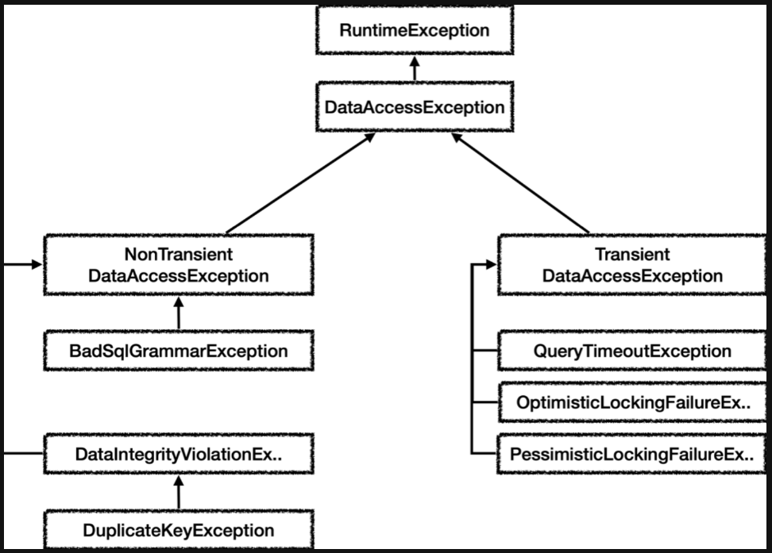
      * 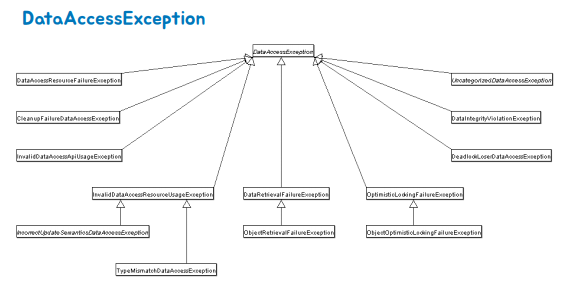
        * DB의 에러코드와 데이터 엑세스 기술에 독립적인 예외 구조
        * 적절한 예외 번역(exception translation) 도구를 제공
      * DataIntegrityViolationException 
        * 에러코드, 어떤 기술이든 상관없이 항상 이 예외가 던져지도록 함
        * 이 예외가 catch하면 됨, 기술 변경해도 상관 X
      * 스프링이 제공하는 DB에러코드의 매핑정보
        * 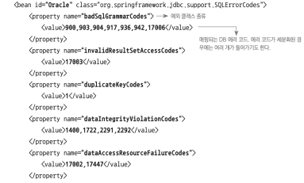

* ## 추가적으로 공부해본 스프링의 예외 처리
  * ### 스프링 예외 처리에 대한 흚
    * 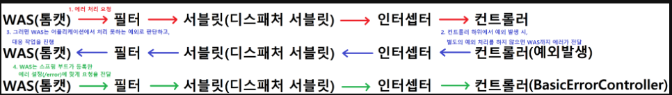
    * 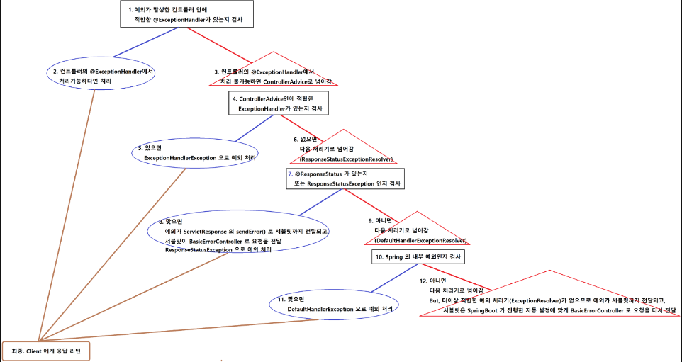
      * 1 ~ 6 : ExceptionHandlerExceptionResolver 가 동작
      * 7 ~ 9 : ResponseStatusExceptionResolver 가 동작
      * 10 ~ 12 : DefaultHandlerExceptionResolver가 동작
      * 12 : 적합한 ExceptionResolver 가 없음
  * ### 체크 예외의 문제점 -> 무조건 잡거나, 잡지 못하면 throw를 선언해 던져야만 함
    * 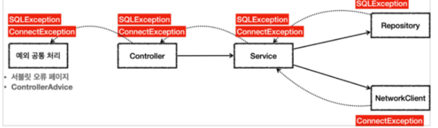
  * ### jdbcTemplate(JDBC 반복문제 해결) -> 템플릿/콜백 패턴이 쓰임 / 예외 발생 시 스프링 예외 변환기도 자동 실행해줌
    * dbcTemplate은 SQLException을 단지 런타임 예외인 DataAccessException으로 포장하는 것이 아니라 DB의 에러 코드를 DataAccessException 계층구조의 클래스 중 하나로 매핑해준다.
    * JdbcTemplate에서 던지는 예외는 모두 DataAccessException의 서브클래스 타입이다.
    * SQLException을 단지 런타임 예외인 DataAccessException으로 포장하는 것이 아니라 DB의 에러코드를 DataAccessException 계층구조의 클래스중 하나로 매핑해준다.
  
  * 참고할 만한 블로그 
    * https://velog.io/@semi-cloud/Spring-DB-%EC%8A%A4%ED%94%84%EB%A7%81-%EC%98%88%EC%99%B8-%EC%B6%94%EC%83%81%ED%99%94
    * https://hsb422.tistory.com/entry/%E3%85%81%EB%AC%B8%EB%B2%95-%EC%8A%A4%ED%94%84%EB%A7%81-%EC%98%88%EC%99%B8-%EC%B6%94%EC%83%81%ED%99%94
    * https://velog.io/@baekgom/RestControllerAdvice-%EC%98%88%EC%99%B8-%EC%B2%98%EB%A6%AC-%EA%B5%AC%ED%98%84%ED%95%98%EA%B8%B0
    * https://velog.io/@semi-cloud/Spring-DB-%EC%98%88%EC%99%B8-%EA%B3%84%EC%B8%B5

