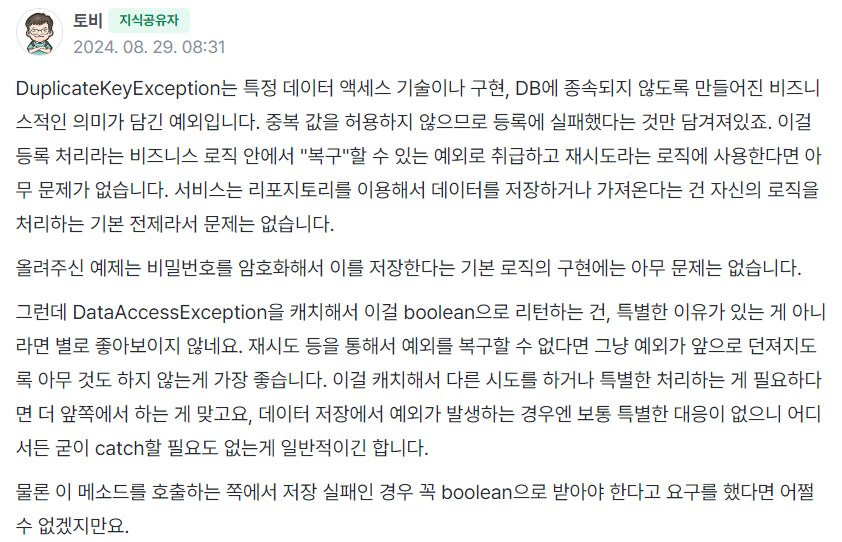
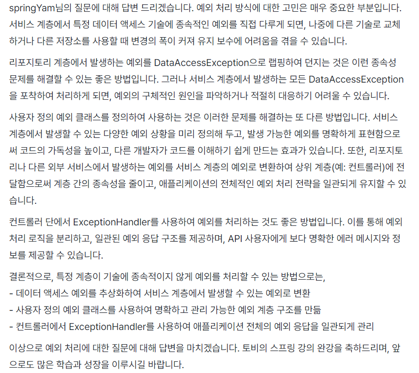
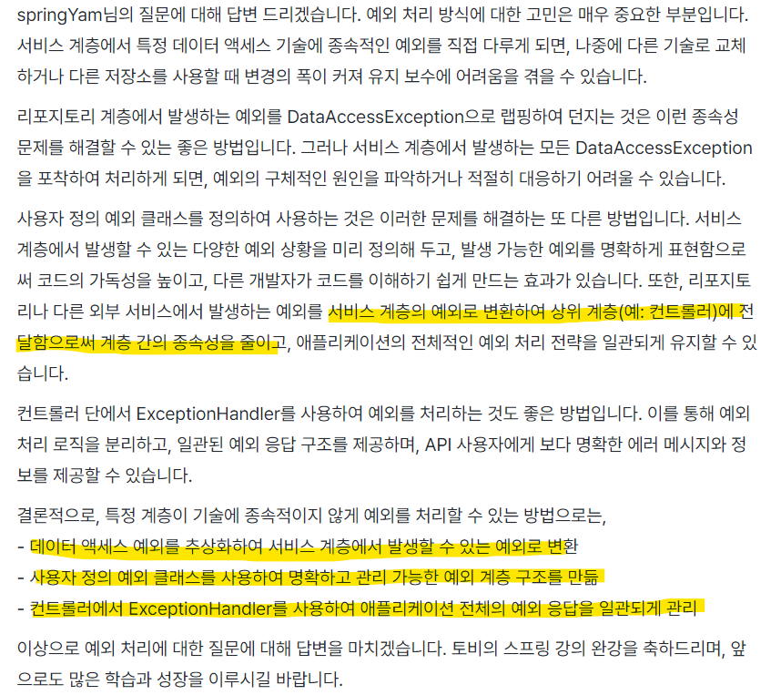

# toby_spring6
토비 스프링 6 study

* ## 오브젝트와 의존관계
  * ### 오브젝트 ? 
    * 클래스의 인스턴스 = 오브젝트
    * 클래스는 오브젝트를 만들기 위한것
    * 클래스는 설계도, 즉 설계도를 통해 오브젝트를 생성
    * 자바에서는 배열(Array)도 오브젝트 
  * ### 의존관계 ?
    * 
    * Client의 기능이 제대로 동작하려면 Supplier가 필요
    * Client가 Supplier를 사용,호출,생성,인스턴스화,전송
    * 클래스 레벨(코드 레벨)의 의존관계 
    * Supplier가 변경되면 Client코드가 영향을 받음
    * 오브젝트 사이에 의존관계는 실행되는 런타임에 의존관계가 만들어지고 실행 기능에 영향을 받지만 클래스 레벨의 의존관계와는 다를 수 있음
    

* ## 관심사의 분리 (Separation of Concerns) -> 변경의 이유, 시점이 다른 n개 관심사들을 분리
  * ### 1. 하나의 메서드에 변하는 이유/시점이 다른 관심사들을 분리 -> 메서드 추출
    * 
  * ### 2. 하나의 클래스가 두가지의 관심사를 가지고 있다면 잘 변하는 부분을 분리 -> 상속을 통한 확장(템플릿 메서드 패턴 : 변하지 않는 부분을 상위클래스에 두고 변하는 부분을 상속을 통해 완성 )
    * 
    * 상속의 단점 : 상하위 클래스의 관계가 매우 밀접, 상위 클래스의 변경에 따라 하위 클래스를 모두 변경해야함
  * ### 3. 관심사에 따른 클래스의 분리 -> 포함(Composite) 관계
    * 
    * 클래스 레벨에 사용 의존관계가 만들어지기 떄문에 강한 코드 수준의 결합이 생김 -> 실제로 사용할 클래스가 변경되면 이용하는 쪽의 코드도 변경되어야 함
    * 상속한 것이 아니기 때문에 사용하는 클래스의 메서드 이름과 구조도 제각각일 수도 있음
  * ### 4. 인터페이스 도입
    *  
    * WebApiExRateProver 코드 수정시 PaymentService도 일부분 수정해야함 -> 클래스의 인스턴스를 만드는 생성자를 호출하는 코드에는 클래스 이름이 등장하기 때문
    * 런타임 시점의 관계
      * 
  * ### 5. 관계설정 책임의 분리
    * 
      * 자신이 어떤 클래스의 오브젝트를 사용할지를 결정 -> 관계설정 책임을 직접 가지고 있는것
      * 코드레벨에서의 의존관계 != 런타임 시점의 의존관계 -> 둘이 다를 수 있음
      * 런타임 시점의 사용해야 할 오브젝트를 설정하는 책임이 어디있는가? -> 이부분에 따라서 코드레벨의 의존관계도 달라짐
      * 의존관계를 설정하는 코드를 분리
        * 
          * 관계설정 책임을 자신을 호출하는 앞의 오브젝트(Client)에게 넘긴 것
          * Client는 생성자를 통해 어떤 클래스의 오브젝트를 사용할지 결정한 것을 전달해주면 됨
      * 
        * 여기서 Client도 2가지 관심사를 가지고 있음 
        * 런타임 시점의 오브젝트 사이의 의존관계를 설정하는 책임을 ObjectFactory에게 넘김 -> 사용과 생성을 대한 관심사를 분리
  

* ## 원칙과 패턴
  * ### 개방-폐쇄 원칙(Open-Closed Principle)
    * 클래스나 모듈은 확장에는 열려 있어야 하고 변경에는 닫혀 있어야 한다.
    * 클래스가 기능을 확장할 때 클래스의 코드는 변경 X -> PaymentService의 환율 정보를 가져오는 방법을 확장(전략패턴)/ PaymentService는 변경 X
  * ### 높은 응집도와 낮은 결합도(High Coherence and low coupling)
    * 응집도가 높다는 것은 하나의 모듈이 하나의 책임 또는 관심사에 집중되어 있다는 뜻, 변화가 일어날 떄 해당 모듈에서 변하는 부분이 큼
    * 책임과 관심사가 다른 모듈과는 낮은 결합도, 즉 느슨하게 연결된 형태를 유지하는 것이 바람직 -> 인터페이스 적극 활용
  * ### 전략 패턴(Strategy Pattern)
    * 필요한 알고리즘을 인터페이스를 통해 통째로 외부로 분리하여 구현한 알고리즘 클래스를 필요에 따라서 주입받아 사용
  * ### 제어의 역전(Inversion of Control)
    * PaymentService -> Client 권한(결정권)이 다른 곳으로 이전

* ## 스프링 컨테이너와 의존관계 주입(Dependency Injection)
  * 
  * 
  * 
      * BeanFactory는 ObjectFactory의 구성 정보를 참고해서 동작하게 만듬 
      * 스프링 IoC/DI 컨테이너 : Bean들을 필요할 떄 제공/관리
      * IoC : 어떤 오브젝트를 사용할 것인지에 대한 제어권(결정권)의 이전
      * DI : 의존관계를 외부에서 주입 -> 의존관계에 대한 책임이 외부 오브젝트가 담당 
      * BeanFactory + ObjectFactory : 외부에서 제 3의 오브젝트가 애플리케이션에서 동작할 Bean들을 생성하고 의존관계를 맺어줌 
  * 구성정보를 가져오는 2가지 방법 : @Configuration/@Bean 또는 @Component를 붙어진 클래스들을 스캔하는 @ComponentScan방식

* ## 싱글톤 레지스토리(Singleton Registry)
  * ### @Configuration 안에 있는 @Bean들을 모두 싱글톤 처리
  * ### 싱글톤 패턴의 단점
    * private 생성자를 가지고 있기 때문에 상속 X
    * 싱글톤은 테스트하기 어려움
    * 서버 환경에서는 싱글톤이 하나만 만들어지는 것을 보장 X
    * 싱글톤의 사용은 전역 상태를 만들 수 있기 떄문에 바람직 X
  * ### 스프링 컨테이너는 Bean들이 모두 기본적으로 싱글톤으로 등록됨 -> 스코프를 프로토타입으로 지정하면 여러 개의 빈 생성 가능

* ## DI와 디자인 패턴
  * 
    * 디자인 패턴을 구분하는 두 가지 방식 : 사용 목적(purpose), 스코프(scope)
      * 클래스 패턴 : 상속을 이용한 확장성을 가진 패턴
      * 오브젝트 패턴 : 합성(composition)을 이용한 패턴 -> DI(의존성 주입)이 사용됨
      * 
  * ### WebApiExRateProvider에 캐시 기능 추가? -> 데코레이터 패턴 (껍데기가 알맹이 행새, 상속과 포함을 동시에)
    * 
    * 
      * 데코레이터 패턴 -> 오브젝트에 부가적인 기능/책임을 동적으로 부여
    

* ## 의존성 역전 원칙(Dependency Inversion Principle, DI != DIP)
  * ### 1. 상위 수준의 모듈은 하위 수준의 모듈에 의존해서는 안 된다. 둘 모두 추상화에 의존해야 한다.
    * 

      * 모듈 -> 자바에서는 패키지로 모듈을 구분 
      * 둘 모두 추상화에 의존 -> 먼저 인터페이스를 통해서 추상화에 의존하도록 코드를 만들어야 함
    * 
      * 문제점 : 모듈 전체를 보면 아직 상위 모듈이 하위 모듈에 의존하고 있음 -> DIP 위배
      * 해결 : 인터페이스 소유권의 역전이 필요 (Separate Interface 패턴)
    *  
    * 인터페이스가 어떤 패키지에 들어가 있어야 하는가? -> 인터페이스는 이를 구현한 클래스와 같은 패키지가 아닌 이 인터페이스를 사용하는 쪽에 있는 것이 자연스러움
    * 하위 모듈 자체를 갈아끼울 수 있음! -> 하위 모듈이 어떤 일을 하든 상위 모듈은 영향을 받지 않음, 상위 모듈의 변경은 반대로 영향을 줌
  * ### 2. 추상화는 구체적인 사항에 의존해서는 안 된다. 구체적인 사항은 추상화에 의존해야 한다.
  
-----

* ## 테스트
  * ### 수동 테스트의 한계
    * 프린트된 메시지를 수동으로 확인하는 방법은 불편하다.
    * 사용자 웹 UI까지 개발한 뒤에 확인하는 방법은 테스트가 실패했을 때 확인할 코드가 많다
    * 테스트할 대상이 많아질 수록 검증하는데 시간이 많이 걸리고 부정확함
  * ### (작은 크기의) 자동 테스트
    * ### 개발자가 만드는 테스트
      * 검증 기능 추가, Junit 프레임워크 사용, 개발 과정의 일부임

* ## PaymentService 테스트의 문제점
  * ### 1. 우리가 제어할 수 없는 시스템에 문제가 생기면? -> ExRateProviderStub (테스트용 오브젝트 생성)
  * ### 2. ExRateProvider가 제공하는 환율 값으로 계산한 것인가? -> assert를 이용해서 예상하는 값과 비교 
  * ### 3. 환율 유효 시간 계산은 정확한 것인가? -> 학습 테스트

* ## 테스트 구성요소
  * 
  * 
  * 
    * 테스트 대상 : PaymentService
    * 협력자 : WebApiExRateProvider
    * 테스트용 오브젝트(Test Double) : ExRateProviderStub -> 테스트를 수행하는 동안만 사용하는 오브젝트
    * 외부 API 사용시 테스트 대역을 만들어 테스트할 수 있음 (인터넷 없이도 동작이 가능)
    * isEqualByComparingTo() -> BigDecimal이 권장하는 메서드
  
* ## 테스트와 DI
  * ### 수동 DI를 이용하는 테스트
    * 테스트용 협력자((Collborator)/의존 오브젝트를 테스트 대상에 직접 주입하고 테스트
  * ### 스프링 DI를 이용하는 테스트
    * 테스트용 협력자(Collborator)/의존 오브젝트를 스프링의 구성 정보를 이용해서 지정하고 컨테이너로부터 테스트 대상을 가져와서 테스트
    *  @ContextConfiguration + @ExtendWith : 빈 구성정보 컨테이너를 불러옴, 스프링 테스팅 기능을 사용하도록 지정
    *  @Autowired : 스프링 컨테이너를 뒤져서 의존 오브젝트 자동주입

* ## 학습 테스트
  * ### 직접 만들지 않은 코드, 라이브러리, 레거시 시스템에 대한 테스트
  * ### 테스트 대상의 사용방법을 익히고 동작방식을 확인하는데 유용, 외부 기술, 서비스가 버전이 올라갔을 때 이전과 동일하게 동작하는지 확인가능
  * 
    * Fixed Clock : 시간을 정해둔 것, 우리가 만든 것이 아닌 자바 라이브러리안에 있는 것
    * PaymentService가 이용하는 의존 오브젝트로 동작할려면 빈으로 등록되어야함 -> @Configuration에 빈으로 등록되어야 함
    
* ## 도메인 오브젝트 테스트 
  * ### 도메인 모델 아키텍처 패턴 
    * 도메인 로직, 비즈니스 로직을 어디에 둘 지를 결정하는 패턴
    * 1 . 트랜잭션 스크립트 - 서비스 메서드 (PaymentService.prepare)
      * 비즈니스 로직을 서비스 계층에 넣어두는 것
    * 2 . 도메인 모델 - 도메인 모델 오브젝트 (Payment)
      * 비즈니스 로직이 엔티티 안에 구성
      * 도메인 모델 : 값만 가지고 있는 것이 아닌 기능을 수행하는 코드가 들어가 있는 것 -> Test 용이
      * Payment는 속성과 Setter&Getter만 가지고 있음 -> 도메인 오브젝트로 만들려면 비즈니스 로직을 추가하면 됨 
      * PaymentService의 비즈니스 로직을 -> Payment 로 이동 
      * 생성자 < Factory Method why? -> 의미있는 이름을 지정해줄 수 있음
      * ### 장점 ?
        * 서비스의 많은 로직이 엔티티로 이동하고, 서비스는 엔티티를 호출하는 정도의 얇은 비즈니스 로직을 가지게 됨
        * Payment 엔티티와 관련된 로직을 가지고 있기 때문에 응집도가 올라가고 중복을 방지하고, 재사용성이 올라감
        * 즉, <strong> Payment가 가지고 있는 정보(iv)를 이용해서 해낼 수 있는 작업이 있다면 Payment에게 요구하면 된다는 것! </strong>

* ## 도메인 주도 설계 (Domain Driven Development)
  * ### 도메인이 비즈니스 로직의 주도권을 가지고 개발하는 것
  * ### 장점 : 서비스의 많은 로직이 엔티티로 이동하고, 서비스는 엔티티를 호출하는 정도의 얇은 비즈니스 로직을 가지게 됨

* ## 8/21 공부하다 생긴 궁금한 것들 
  * ### DIP를 Spring MVC패턴의 3계층에 적용한다면 ? -> 컨트롤러가 있는 웹 계층과 서비스 계층에는 DIP를 적용하지 않음
    * DIP에서 의존성 역전을 하는 이유는 애플리케이션의 중심이 되는 도메인/비즈니스 로직을 가진 가장 상위 모듈이 기술적인 메카니즘을 다루는 변경 가능성이 높은 하위모듈에 의존하지 않게 만드는 것이 목적
    * 보통 서비스 계층과 이 안에서 다루는 도메인/엔티티 오브젝트가 가장 중심이 되는 상위 모듈이라고 보면 됨
    * 데이터를 다루거나, API 등 외부 서비스를 이용하는 부분에 DIP를 적용하면 인터페이스 소유권까지 역전하는게 맞음
    * 웹 컨트롤러와 같이 사용자 또는 클라이언트와 연결이 되고 주로 UI/Web 등을 담당하는 계층은 의존관계가 그대로 일반적인 아키텍처 그림에서 아래로 내려가는 것이 맞음
    * 일반적인 요청 흐름 : 웹 -> 서비스 -> 데이터
    *  가장 상위(정책, 로직) 모듈을 가리키게 됨 : 웹 -> 서비스 <- 데이터

  * ### @Configuration 적용 전후 차이 ?
    * 적용 전: @Configuration이 없으면, TestObjectFactory는 단순한 자바 클래스처럼 동작하여 @Bean 메서드가 호출될 때마다 새로운 객체를 생성
    * 적용 후: @Configuration이 있으면, 스프링 컨테이너는 TestObjectFactory 클래스를 프록시로 감싸서 싱글톤 패턴을 보장하며, 이를 통해 동일한 빈 인스턴스를 반환
    * 즉, <strong> @Configuration이 있으면, 모든 @Bean 메서드는 스프링 컨테이너에서 관리 </strong>

  * ### DTO vs Entity(Domain) ?
    * 
    * 
      * Client <- dto -> controller(web) - service - repository(dao) <- domain(entity) -> DB
      * DTO :  각 계층 간을 이동할 때 데이터를 '전달'해주는 클래스
      * Domain : 소프트웨어로 해결하고자 하는 문제 영역
      * Domain Model Object :  도메인 모델 객체는 해당 도메인의 비즈니스 로직이나 요구사항을 포함
      * Entity : 엔티티(entity)는 DB의 테이블이나 도큐먼트를 표현하는 객체
   